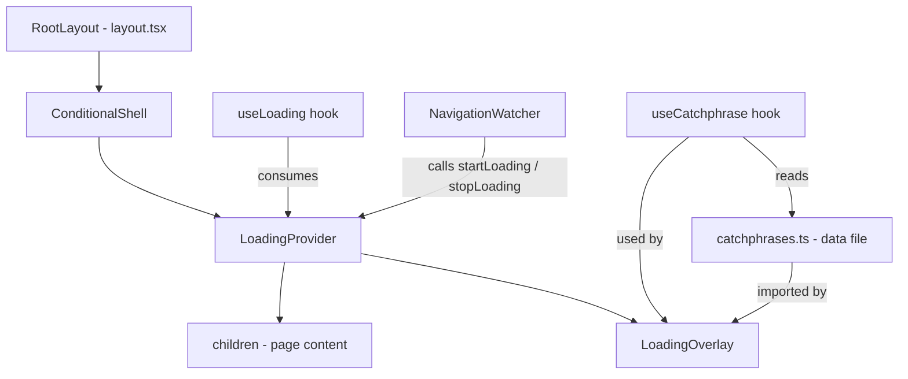

# Design Document: Loading Screen Catchphrases

## Overview

This feature adds a full-screen loading overlay to the OpsPilot SMB survival agent dashboard. The overlay appears during every page transition and async operation on authenticated routes, displaying a fixed brand image and a rotating business-rescue-themed catchphrase. It is wired into the existing `ConditionalShell` root layout wrapper so it is available across the entire authenticated application without touching individual route components.

The design is intentionally additive — no existing components are modified beyond `ConditionalShell` and `RootLayout`. All new code lives in dedicated files.

---

## Architecture



**Key design decisions:**

- `LoadingProvider` owns all state (count, visibility, minimum-duration timer). It is a `"use client"` component placed just inside `ConditionalShell` so it wraps both the shell chrome and the page children.
- `LoadingOverlay` is a pure presentational component that receives `isVisible` and `catchphrase` as props. This makes it trivially testable.
- `NavigationWatcher` is a thin `"use client"` component that uses `usePathname` to detect route changes and calls `startLoading`/`stopLoading` via the `useLoading` hook. It renders `null`.
- The catchphrase pool lives in `src/lib/catchphrases.ts` — a plain TypeScript array export with no component logic.
- The `useCatchphrase` hook encapsulates the no-consecutive-repeat rotation logic, keeping it independently testable.

---

## Components and Interfaces

### `LoadingContext`

```ts
interface LoadingContextValue {
  isLoading: boolean
  startLoading: () => void
  stopLoading: () => void
}
```

Provided by `LoadingProvider`. Consumed via the `useLoading` hook.

---

### `LoadingProvider`

**File:** `src/components/loading/loading-provider.tsx`  
**Type:** `"use client"` React context provider

Responsibilities:
- Maintains a `count: number` ref (reference counter).
- Maintains `isVisible: boolean` state (derived: `count > 0` OR within minimum display window).
- On `startLoading`: increments count, records `startTime`, sets `isVisible = true`.
- On `stopLoading`: decrements count (floor 0). If count reaches 0, schedules hide after `max(0, 600 - elapsed)` ms.
- Exposes `isLoading`, `startLoading`, `stopLoading` via context.
- Renders `<LoadingOverlay>` and `<NavigationWatcher>` as siblings to `{children}`.

---

### `LoadingOverlay`

**File:** `src/components/loading/loading-overlay.tsx`  
**Type:** `"use client"` presentational component

Props:
```ts
interface LoadingOverlayProps {
  isVisible: boolean
  catchphrase: string
}
```

Renders:
- A `fixed inset-0 z-50` container with `bg-background/95 backdrop-blur-sm`.
- Centered flex column: brand image (80×80px) → catchphrase text → spinner.
- Spinner: CSS `animate-spin` border element; replaced with a static pulsing dot when `prefers-reduced-motion` is detected via a `useReducedMotion` hook.
- Uses `pointer-events-none` when `!isVisible`; `pointer-events-auto` when visible.
- Visibility toggled via `opacity-0 / opacity-100` + `transition-opacity duration-200` (avoids layout shift).

---

### `NavigationWatcher`

**File:** `src/components/loading/navigation-watcher.tsx`  
**Type:** `"use client"` component, renders `null`

Uses `usePathname()` from `next/navigation`. On pathname change:
1. Calls `startLoading()` when the pathname value changes (detected via `useEffect` dependency on `pathname`).
2. Calls `stopLoading()` in the same effect's cleanup / on the next render after the new page mounts.

This pattern works with Next.js App Router: `usePathname` updates after the new segment is committed, so the effect fires after navigation completes. The overlay is shown during the transition window.

---

### `useCatchphrase` hook

**File:** `src/hooks/use-catchphrase.ts`  
**Type:** Client hook

```ts
function useCatchphrase(trigger: boolean): string
```

- Maintains an internal shuffled queue (copy of the pool, shuffled on init and on exhaustion).
- On each `trigger` rising edge (`false → true`), advances to the next catchphrase in the queue.
- Ensures the newly selected catchphrase is never equal to the previously shown one (if it is, swaps with the next item in the queue).
- Returns the current catchphrase string.

---

### `useLoading` hook

**File:** `src/hooks/use-loading.ts`

```ts
function useLoading(): LoadingContextValue
```

Thin wrapper around `useContext(LoadingContext)` with a guard that throws if used outside `LoadingProvider`.

---

### `useReducedMotion` hook

**File:** `src/hooks/use-reduced-motion.ts`

```ts
function useReducedMotion(): boolean
```

Returns `true` if `window.matchMedia('(prefers-reduced-motion: reduce)').matches`.

---

## Data Models

### Catchphrase Pool

**File:** `src/lib/catchphrases.ts`

```ts
export const CATCHPHRASES: readonly string[] = [
  "Chasing invoices so you don't have to.",
  "Your cash flow has a rescue team now.",
  "Turning overdue into on-time, one call at a time.",
  "Finding the financing gap before it finds you.",
  "Vendor prices creep. We catch them.",
  "Insurance renewal? We already compared the market.",
  "Receivables recovered. Margin defended.",
  "The survival scan is running. Breathe.",
  "Every dollar late is a dollar we're hunting.",
  "Working capital, located.",
  "Stress-testing your runway so you don't have to.",
  "The rescue queue is moving. Hold tight.",
  "Autonomous ops. Human-grade hustle.",
  "Cash is late. The agent is not.",
  "Survival mode: activated.",
  "Scanning for savings you didn't know existed.",
  "Your books are talking. We're listening.",
  "Financing options, ranked and ready.",
]
```

Minimum 15 entries (18 provided). All strings are distinct. This file is the single source of truth — no catchphrase logic lives elsewhere.

---

### Loading State

```ts
interface LoadingState {
  count: number          // reference counter; loading is active when count > 0
  isVisible: boolean     // true when count > 0 OR within minimum display window
  startTime: number | null  // Date.now() when loading last became active
}
```

State is internal to `LoadingProvider` and not exposed directly.

---

## Integration with ConditionalShell

`ConditionalShell` is updated minimally:

```tsx
// src/components/layout/conditional-shell.tsx (updated)
"use client"

import { usePathname } from "next/navigation"
import { Sidebar } from "./sidebar"
import { Header } from "./header"
import { LoadingProvider } from "@/components/loading/loading-provider"

export function ConditionalShell({ children }: { children: React.ReactNode }) {
  const pathname = usePathname()

  if (pathname === "/") {
    return <>{children}</>
  }

  return (
    <LoadingProvider>
      <div className="flex h-full overflow-hidden bg-background">
        <Sidebar />
        <div className="flex flex-1 flex-col overflow-hidden">
          <Header />
          <main className="flex-1 overflow-y-auto">{children}</main>
        </div>
      </div>
    </LoadingProvider>
  )
}
```

`LoadingProvider` wraps the entire authenticated shell. The landing page (`/`) is excluded by the existing `pathname === "/"` guard — no overlay is ever mounted for that route.

---

## Correctness Properties

*A property is a characteristic or behavior that should hold true across all valid executions of a system — essentially, a formal statement about what the system should do. Properties serve as the bridge between human-readable specifications and machine-verifiable correctness guarantees.*

### Property 1: Catchphrase always from pool

*For any* sequence of loading trigger events, every catchphrase selected and displayed by `useCatchphrase` SHALL be a member of the `CATCHPHRASES` pool.

**Validates: Requirements 2.2**

---

### Property 2: No consecutive repeat

*For any* sequence of two or more consecutive loading appearances, no two adjacent catchphrases in the sequence SHALL be equal.

**Validates: Requirements 2.3, 2.4**

---

### Property 3: Reference-count loading invariant

*For any* integer N ≥ 1, after calling `startLoading` N times, the loading state SHALL remain active after N−1 calls to `stopLoading`, and SHALL become inactive only after the Nth call to `stopLoading` (once the minimum display duration has elapsed).

**Validates: Requirements 4.3, 4.4**

---

### Property 4: Minimum display duration

*For any* loading session where `stopLoading` is called at time T after `startLoading`, the overlay SHALL remain visible until at least `startTime + 600ms`, regardless of how small T is. When T > 600ms, the overlay SHALL hide at T.

**Validates: Requirements 5.1, 5.2, 5.3**

---

### Property 5: Route-gating invariant

*For any* route string R, the `LoadingOverlay` SHALL be mounted and eligible to render if and only if R ≠ `"/"`.

**Validates: Requirements 7.1, 7.2**

---

## Error Handling

| Scenario | Handling |
|---|---|
| `useLoading` called outside `LoadingProvider` | Throws a descriptive error: `"useLoading must be used within a LoadingProvider"` |
| `stopLoading` called when count is already 0 | No-op; count stays at 0; no error thrown (Requirement 4.4) |
| `CATCHPHRASES` pool has only 1 entry | `useCatchphrase` returns the single entry on every trigger (no-repeat rule cannot be satisfied; single-entry pool is a degenerate case documented in code) |
| `window.matchMedia` unavailable (SSR) | `useReducedMotion` returns `false` (safe default; overlay is client-only anyway) |
| Brand image fails to load | `` `onError` hides the broken image element; overlay continues to show catchphrase and spinner |

---

## Testing Strategy

### Unit tests (Vitest + React Testing Library)

- `CATCHPHRASES` pool: assert length ≥ 15 and all entries are unique strings.
- `LoadingOverlay`: snapshot test; assert `pointer-events-none` when `isVisible=false`; assert catchphrase text is rendered; assert spinner present; assert 80×80 brand image.
- `useLoading`: assert throws outside provider.
- `LoadingProvider` API: assert `startLoading`/`stopLoading` are functions on context value.
- `useReducedMotion`: mock `matchMedia` and assert correct boolean return.

### Property-based tests (fast-check, minimum 100 iterations each)

Each property test is tagged with a comment referencing the design property.

- **Property 1** — `// Feature: loading-screen-catchphrases, Property 1: catchphrase always from pool`  
  Generate sequences of N trigger events (N: 1–50). Assert every returned catchphrase is in `CATCHPHRASES`.

- **Property 2** — `// Feature: loading-screen-catchphrases, Property 2: no consecutive repeat`  
  Generate sequences of N trigger events (N: 2–100, including N > pool size to exercise reset). Assert no two adjacent catchphrases are equal.

- **Property 3** — `// Feature: loading-screen-catchphrases, Property 3: reference-count loading invariant`  
  Generate N (1–20). Call `startLoading` N times. Assert `isLoading` is true after each of the first N−1 `stopLoading` calls. Assert `isLoading` becomes false after the Nth `stopLoading` (after 600ms minimum). Also assert calling `stopLoading` at count=0 does not throw.

- **Property 4** — `// Feature: loading-screen-catchphrases, Property 4: minimum display duration`  
  Generate `stopDelay` in [0, 1200]ms. Use fake timers. Assert overlay is still visible at `stopDelay` if `stopDelay < 600`, and hidden at `max(stopDelay, 600)`.

- **Property 5** — `// Feature: loading-screen-catchphrases, Property 5: route-gating invariant`  
  Generate arbitrary route strings (including `"/"`, `"/rescue"`, `"/dashboard"`, random paths). Assert `ConditionalShell` mounts `LoadingProvider` iff route ≠ `"/"`.

### Integration tests

- `NavigationWatcher`: mock `usePathname` to simulate route changes; assert `startLoading` is called on change and `stopLoading` is called after mount.
- End-to-end smoke: render full `ConditionalShell` tree on a non-root route; assert `LoadingOverlay` is present in the DOM.
