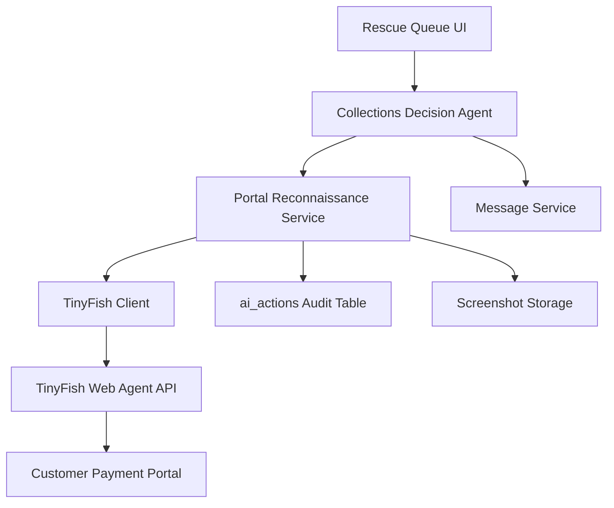

> **Historical Note:** This spec was written during the OpsPilot → Resq transition. References to "OpsPilot" are historical.

# Design Document: TinyFish Portal Login

## Overview

The TinyFish Portal Login feature enables the OpsPilot Rescue Collections Agent to perform intelligent pre-collection reconnaissance by authenticating into customer payment portals using TinyFish Web Agent's vault credential system. This capability demonstrates true agentic behavior by taking multi-step actions across external systems: logging in, verifying invoice visibility, checking payment status, analyzing customer activity, and sending portal-native messages before escalating to traditional collection methods.

This feature is the most demo-able part of the autonomous collections agent and serves as proof of the system's ability to investigate external context before taking action.

### Key Design Principles

1. **Three-mode operation**: Mock (demo-safe), misconfigured (graceful warnings), and live (real TinyFish API)
2. **Graceful degradation**: Live mode failures fall back to fixture data without crashing
3. **Auditability**: All portal actions logged to `ai_actions` with screenshots and timestamps
4. **Integration-first**: Designed to inform Collections Decision Agent without owning financial truth
5. **Demo reliability**: Mock mode returns realistic data within 500ms for hackathon presentations

## Architecture

### System Context



### Component Responsibilities

**Portal Reconnaissance Service** (`src/lib/services/portal-reconnaissance.ts`)
- Orchestrates the full portal login workflow
- Manages three-mode operation (mock/misconfigured/live)
- Handles graceful degradation from live to mock
- Returns typed reconnaissance results

**Portal HTML Parser** (`src/lib/services/portal-html-parser.ts`)
- Extracts invoice data from portal HTML
- Extracts payment status and customer activity
- Returns confidence scores for parsed data
- Handles common portal formats (tables, cards, JSON-embedded)

**Portal Pretty Printer** (`src/lib/services/portal-pretty-printer.ts`)
- Formats parsed portal data into human-readable summaries
- Used for audit logs and UI display

**TinyFish Client Extension** (`src/lib/tinyfish/client.ts`)
- Adds `runPortalLogin()` method following existing patterns
- Supports vault credential authentication
- Handles browser profile and stealth mode configuration

**Portal Reconnaissance API** (`src/app/api/tinyfish/portal-recon/route.ts`)
- Exposes `POST /api/tinyfish/portal-recon` endpoint
- Validates request parameters
- Returns typed response with mode indicators

**Collections Decision Agent Integration** (`src/lib/services/collections-decision-agent.ts`)
- Consumes portal reconnaissance data
- Adjusts collection strategy based on portal signals
- Includes portal context in reasoning display

### Data Flow

1. **Trigger**: Collections Decision Agent evaluates an overdue invoice
2. **Request**: Portal Reconnaissance Service receives `invoiceId` and optional `customerId`
3. **Mode Check**: Determine operation mode (mock/misconfigured/live)
4. **Authentication**: TinyFish authenticates using vault credentials (live mode only)
5. **Navigation**: Navigate to invoices/billing section
6. **Extraction**: Parse invoice visibility, payment status, customer activity
7. **Messaging**: Send portal-native message if supported (optional)
8. **Capture**: Take screenshots at each major step
9. **Audit**: Log all actions to `ai_actions` table
10. **Return**: Typed response with reconnaissance results and mode indicators
11. **Decision**: Collections Decision Agent adjusts strategy based on signals

## Components and Interfaces

### Portal Reconnaissance Result

```typescript
interface PortalReconnaissanceResult {
  mode: 'mock' | 'misconfigured' | 'live'
  degradedFromLive: boolean
  warning: string | null
  result: {
    // Invoice visibility
    visibility: boolean
    visibilityReason: string | null
    visibilityConfidence: number // 0-100
    
    // Payment status
    paymentStatus: 'unpaid' | 'processing' | 'paid' | 'failed' | 'unknown'
    paymentDate: string | null
    paymentMethod: string | null
    shouldSkipCollection: boolean
    
    // Customer activity
    lastLoginAt: string | null
    hasRecentActivity: boolean // within 7 days
    invoiceViewCount: number | null
    invoiceViewTimestamps: string[]
    engagementLevel: 'high' | 'medium' | 'low' | 'none'
    activityConfidence: number // 0-100
    
    // Messaging
    messageSent: boolean
    messageSentAt: string | null
    messageFailureReason: string | null
    
    // Proof and audit
    screenshots: Screenshot[]
    portalUrl: string
    tinyfishRunId: string | null
    
    // Error handling
    authFailed: boolean
    botDetected: boolean
    parsingFailed: boolean
  }
}

interface Screenshot {
  step: 'login' | 'invoice_list' | 'invoice_detail' | 'payment_status' | 'message_sent'
  url: string // S3 URL or base64 data URI
  timestamp: string
  invoiceId: string
}
```

### Portal HTML Parser Interface

```typescript
interface ParsedPortalData {
  invoices: ParsedInvoice[]
  customerActivity: ParsedActivity
  confidence: number // 0-100
  parsingErrors: string[]
}

interface ParsedInvoice {
  invoiceNumber: string | null
  amount: number | null
  dueDate: string | null
  status: string | null
  paymentDate: string | null
  paymentMethod: string | null
}

interface ParsedActivity {
  lastLoginAt: string | null
  viewCount: number | null
  viewTimestamps: string[]
}
```

### TinyFish Client Extension

```typescript
// Add to src/lib/tinyfish/client.ts
export async function runPortalLogin(opts: {
  portalUrl: string
  invoiceNumber: string
  customerId?: string
  sendMessage?: boolean
  messageDraft?: string
}): Promise<PortalLoginResult>

interface PortalLoginResult {
  mode: 'mock' | 'misconfigured' | 'live'
  degradedFromLive: boolean
  warning: string | null
  status: 'COMPLETED' | 'FAILED' | 'AUTH_FAILED' | 'BOT_DETECTED'
  result: {
    authenticated: boolean
    invoiceFound: boolean
    invoiceData: Record<string, unknown>
    activityData: Record<string, unknown>
    messageSent: boolean
    screenshots: Array<{ step: string; data: string }>
  }
  steps: Array<{
    index: number
    label: string
    observation: string
    durationMs: number
  }>
  tinyfishRunId: string | null
}
```

### Collections Decision Agent Integration

```typescript
// Extend existing CollectionsDecisionContext
interface CollectionsDecisionContext {
  // ... existing fields
  portalReconnaissance?: {
    visibility: boolean
    paymentStatus: string
    shouldSkipCollection: boolean
    hasRecentActivity: boolean
    engagementLevel: string
    messageSent: boolean
    confidence: number
  }
}
```

## Data Models

### Database Schema Extensions

**ai_actions table** (existing, no changes needed)
- Already supports `action_type`, `metadata`, `result`, `created_at`
- Portal actions will use `action_type: 'portal_reconnaissance'`
- Metadata will include: `portalUrl`, `invoiceId`, `customerId`, `tinyfishRunId`

**screenshots storage** (new, optional S3 integration)
- Path pattern: `screenshots/{invoiceId}/{timestamp}_{step}.png`
- Fallback: base64-encoded data URIs in response
- Retention: 30 days (configurable)

### Mock Data Fixtures

```typescript
// src/lib/tinyfish/mock-data.ts additions
export const PORTAL_RECON_FIXTURES = {
  invoice_visible_unpaid: {
    visibility: true,
    paymentStatus: 'unpaid',
    shouldSkipCollection: false,
    hasRecentActivity: true,
    engagementLevel: 'high',
    visibilityConfidence: 95,
    activityConfidence: 90,
  },
  invoice_visible_processing: {
    visibility: true,
    paymentStatus: 'processing',
    shouldSkipCollection: true,
    hasRecentActivity: true,
    engagementLevel: 'high',
    visibilityConfidence: 95,
    activityConfidence: 90,
  },
  invoice_not_visible: {
    visibility: false,
    visibilityReason: 'not in customer view',
    paymentStatus: 'unknown',
    shouldSkipCollection: false,
    hasRecentActivity: false,
    engagementLevel: 'low',
    visibilityConfidence: 85,
    activityConfidence: 60,
  },
  high_engagement: {
    visibility: true,
    paymentStatus: 'unpaid',
    shouldSkipCollection: false,
    hasRecentActivity: true,
    engagementLevel: 'high',
    lastLoginAt: new Date(Date.now() - 2 * 24 * 60 * 60 * 1000).toISOString(),
    invoiceViewCount: 5,
    visibilityConfidence: 95,
    activityConfidence: 95,
  },
  low_engagement: {
    visibility: true,
    paymentStatus: 'unpaid',
    shouldSkipCollection: false,
    hasRecentActivity: false,
    engagementLevel: 'low',
    lastLoginAt: new Date(Date.now() - 30 * 24 * 60 * 60 * 1000).toISOString(),
    invoiceViewCount: 0,
    visibilityConfidence: 95,
    activityConfidence: 80,
  },
}
```

## Correctness Properties

### Property-Based Testing Applicability Assessment

This feature is primarily an **integration and infrastructure feature** involving:
- External service integration (TinyFish Web Agent API, customer portals)
- Browser automation and session management
- Infrastructure wiring and configuration
- Screenshot capture and storage

**PBT is NOT appropriate** for the majority of this feature because:
1. **Testing external service behavior**: Portal structure is deterministic per site, not a function with varying inputs
2. **Infrastructure verification**: Authentication and session management are one-time setup checks
3. **High cost for repeated execution**: Browser automation and API calls are expensive (100 iterations would be wasteful)
4. **Behavior doesn't vary meaningfully**: Portal login either works or doesn't for a given credential set

**However, PBT IS appropriate** for one component: **HTML parsing with round-trip properties**.

The Portal HTML Parser extracts structured data from HTML and the Portal Pretty Printer formats it back. This is a pure transformation suitable for property-based testing.

### Property 1: Portal Data Round-Trip Preservation

*For any* valid parsed portal data object, formatting it with the Pretty Printer and then parsing the formatted output SHALL produce an equivalent object with the same invoice numbers, amounts, dates, and status fields.

**Validates: Requirements 11.1, 11.2, 11.5**

**Rationale**: This property ensures that our parsing and formatting logic are inverses of each other, which is critical for data integrity when displaying portal information to users and logging it for audit purposes.

## Error Handling

### Error Categories and Recovery Strategies

**1. Configuration Errors** (misconfigured mode)
- Missing `TINYFISH_API_KEY`
- Missing vault credential configuration
- **Recovery**: Return `mode: 'misconfigured'` with warning message, use mock fixtures

**2. Authentication Errors** (live mode)
- Invalid credentials
- Expired credentials
- Domain mismatch
- **Recovery**: Return `authFailed: true`, skip to email collection, log to audit trail

**3. Bot Detection** (live mode)
- CAPTCHA challenge
- Anti-bot protection triggered
- Rate limiting
- **Recovery**: Return `botDetected: true`, fall back to fixtures, log for credential rotation

**4. Parsing Errors** (live mode)
- Portal structure changed
- Unexpected HTML format
- Missing expected selectors
- **Recovery**: Return `parsingFailed: true` with low confidence, use partial data if available

**5. Network Errors** (live mode)
- TinyFish API timeout (429, 5xx)
- Portal unreachable
- Connection failures
- **Recovery**: Retry with exponential backoff (max 2 attempts), then degrade to fixtures

**6. Timeout Errors** (live mode)
- Portal login exceeds 30 seconds
- TinyFish run exceeds configured timeout
- **Recovery**: Cancel operation, return partial results if available, degrade to fixtures

### Error Response Format

```typescript
interface ErrorResponse {
  mode: 'mock' | 'misconfigured' | 'live'
  degradedFromLive: boolean
  warning: string
  result: {
    // ... partial results if available
    authFailed: boolean
    botDetected: boolean
    parsingFailed: boolean
  }
}
```

### Retry Logic

```typescript
async function retryWithBackoff<T>(
  fn: () => Promise<T>,
  maxAttempts: number = 2
): Promise<T> {
  let lastError: Error
  for (let attempt = 0; attempt < maxAttempts; attempt++) {
    try {
      return await fn()
    } catch (err) {
      lastError = err as Error
      if (shouldRetry(err) && attempt < maxAttempts - 1) {
        await sleep(Math.pow(2, attempt) * 1000) // 1s, 2s
      }
    }
  }
  throw lastError!
}

function shouldRetry(err: unknown): boolean {
  if (err instanceof TinyFishError) {
    return err.kind === 'timeout' || 
           err.kind === 'network' ||
           (err.kind === 'http' && err.status && err.status >= 500)
  }
  return false
}
```

### Audit Trail for Errors

All errors are logged to `ai_actions` with:
- `action_type: 'portal_reconnaissance_error'`
- `metadata`: `{ errorType, errorMessage, recoveryAction, invoiceId, portalUrl }`
- `result`: `{ degradedFromLive: true, fallbackMode: 'mock' }`

## Testing Strategy

### Unit Tests (Example-Based)

**Portal Reconnaissance Service**
- Mock mode returns fixture data within 500ms
- Misconfigured mode returns warning without crashing
- Live mode calls TinyFish client with correct parameters
- Graceful degradation from live to mock on error
- Audit logging for all operations

**Portal HTML Parser**
- Parse table-based invoice lists
- Parse card-based invoice layouts
- Parse JSON-embedded invoice data
- Extract payment status from common formats
- Extract customer activity timestamps
- Handle missing or malformed data gracefully
- Return confidence scores based on matched fields

**Portal Pretty Printer**
- Format parsed invoice data into readable summary
- Format customer activity into readable summary
- Handle null/undefined fields gracefully

**TinyFish Client Extension**
- `runPortalLogin()` constructs correct API payload
- Vault credential parameters passed correctly
- Browser profile set to 'stealth' for anti-bot protection
- Screenshots extracted from TinyFish response
- Error responses handled correctly

**Collections Decision Agent Integration**
- Skip collection when `shouldSkipCollection: true`
- Adjust tone based on `engagementLevel`
- Escalate faster when `visibility: false`
- Prefer portal messaging when `messageSent: true`
- Include portal signals in Assessment block

**API Route**
- Validate request parameters (invoiceId required)
- Return 400 for invalid parameters
- Return 200 for successful reconnaissance
- Return 500 only for unexpected server errors
- Response includes mode indicators

### Property-Based Tests

**Portal HTML Parser Round-Trip**
- Generate random valid portal data objects
- Format with Pretty Printer
- Parse the formatted output
- Assert equivalence of original and round-tripped data
- Run 100 iterations minimum
- Tag: `Feature: tinyfish-portal-login, Property 1: Portal Data Round-Trip Preservation`

### Integration Tests

**End-to-End Portal Reconnaissance** (mock mode)
- Request reconnaissance for test invoice
- Verify response structure matches schema
- Verify screenshots included (mock placeholders)
- Verify audit log entry created
- Verify mode indicators correct

**Collections Decision Integration** (mock mode)
- Trigger collection decision with portal reconnaissance
- Verify portal signals influence decision
- Verify reasoning display includes portal context
- Verify action selection respects `shouldSkipCollection`

**TinyFish Live Mode** (manual, optional)
- Authenticate to test portal with vault credentials
- Verify invoice visibility detection
- Verify payment status extraction
- Verify customer activity analysis
- Verify screenshot capture
- Verify graceful degradation on error

### Demo Scenarios

**Scenario 1: Invoice Visible, Unpaid, High Engagement**
- Portal shows invoice, customer logged in recently
- Agent sends gentle reminder via portal message
- Reasoning: "Customer engaged, invoice visible, no payment processing"

**Scenario 2: Invoice Visible, Payment Processing**
- Portal shows payment in progress
- Agent skips collection entirely
- Reasoning: "Payment already processing, no action needed"

**Scenario 3: Invoice Not Visible**
- Portal doesn't show invoice in customer view
- Agent escalates to direct contact
- Reasoning: "Invoice not visible to customer, likely billing system issue"

**Scenario 4: Low Engagement**
- Customer hasn't logged in for 30+ days
- Agent uses firmer tone, email channel
- Reasoning: "Low portal engagement, unlikely to see portal message"

**Scenario 5: Bot Detection / Degraded Mode**
- Live mode encounters CAPTCHA
- System falls back to mock data
- UI shows warning: "Portal reconnaissance unavailable, using historical patterns"

## Implementation Notes

### TinyFish Web Agent Integration

**Vault Credential System**
- Credentials stored in TinyFish's password manager integration
- Domain matching: `customer-portal.example.com`
- Multiple credentials per domain supported via `credential_item_ids`
- Credential rotation handled by TinyFish

**Browser Profile Configuration**
```typescript
{
  browser_profile: 'stealth', // anti-bot protection
  use_vault: true,
  credential_domain: 'customer-portal.example.com',
  credential_item_ids: ['cred_abc123'], // optional, for multiple credentials
  screenshot_steps: ['login', 'invoice_list', 'invoice_detail', 'payment_status', 'message_sent'],
  timeout_seconds: 30,
}
```

**Goal Prompt Template**
```
Log into the customer payment portal at {portalUrl} using vault credentials.
Navigate to the invoices or billing section.
Find invoice #{invoiceNumber} (amount: ${amount}).
Extract: invoice visibility, payment status, payment date, payment method.
Extract: customer last login, invoice view count, invoice view timestamps.
If messaging is supported and message draft is provided, send the message.
Capture screenshots at each step: login, invoice list, invoice detail, payment status, message sent.
Return structured JSON with all extracted data.
```

### Collections Decision Agent Integration Points

**1. Pre-Decision Reconnaissance**
```typescript
// In collections-decision-agent.ts
const portalRecon = await portalReconnaissanceService.investigate({
  invoiceId: invoice.id,
  customerId: invoice.customer_id,
})

const context: CollectionsDecisionContext = {
  // ... existing context
  portalReconnaissance: portalRecon.result,
}
```

**2. Decision Logic Adjustments**
```typescript
// Skip collection if payment processing
if (context.portalReconnaissance?.shouldSkipCollection) {
  return {
    action: 'skip',
    reason: 'Payment already processing in customer portal',
    confidence: 95,
  }
}

// Adjust tone based on engagement
const baseTone = calculateBaseTone(context)
const adjustedTone = context.portalReconnaissance?.engagementLevel === 'high'
  ? Math.max(baseTone - 10, 0) // gentler for engaged customers
  : baseTone

// Escalate faster if invoice not visible
const escalationThreshold = context.portalReconnaissance?.visibility === false
  ? 0.6 // lower threshold
  : 0.75 // normal threshold
```

**3. Reasoning Display Enhancement**
```typescript
// In Assessment block
const portalSignals = context.portalReconnaissance
  ? `Portal: ${portalSignals.visibility ? 'Invoice visible' : 'Invoice NOT visible'}, ` +
    `Payment: ${portalSignals.paymentStatus}, ` +
    `Engagement: ${portalSignals.engagementLevel}`
  : null

// In External Signals section
if (portalSignals) {
  externalSignals.push({
    source: 'Customer Portal',
    signal: portalSignals,
    confidence: context.portalReconnaissance.visibilityConfidence,
  })
}
```

### Mode Detection and Configuration

```typescript
// src/lib/env.ts additions
export const TINYFISH_VAULT_ENABLED = process.env.TINYFISH_VAULT_ENABLED === 'true'
export const TINYFISH_PORTAL_RECON_ENABLED = process.env.TINYFISH_PORTAL_RECON_ENABLED === 'true'

export function isPortalReconLiveReady(): boolean {
  return (
    isTinyFishLiveReady() &&
    TINYFISH_VAULT_ENABLED &&
    TINYFISH_PORTAL_RECON_ENABLED
  )
}

export function getPortalReconMode(): 'mock' | 'misconfigured' | 'live' {
  if (isTinyFishMockMode() || !TINYFISH_PORTAL_RECON_ENABLED) {
    return 'mock'
  }
  if (!isPortalReconLiveReady()) {
    return 'misconfigured'
  }
  return 'live'
}
```

### Screenshot Storage Strategy

**Option 1: S3 Storage** (preferred for production)
- Upload to `s3://opspilot-rescue-artifacts/screenshots/{invoiceId}/{timestamp}_{step}.png`
- Return signed URLs in response (7-day expiration)
- Lifecycle policy: delete after 30 days

**Option 2: Base64 Data URIs** (fallback for demo)
- Embed screenshot data directly in response
- Suitable for mock mode and small screenshots
- No external dependencies

**Option 3: Hybrid** (recommended for hackathon)
- Mock mode: base64 placeholder images
- Live mode: attempt S3 upload, fall back to base64 if unavailable

### Performance Considerations

**Mock Mode**
- Target: < 500ms response time
- No network calls
- Deterministic fixture selection based on invoice ID hash

**Live Mode**
- Target: < 30 seconds total (TinyFish timeout)
- Parallel operations where possible (not applicable for sequential portal steps)
- Early termination on critical errors (auth failure, bot detection)
- Streaming screenshots as they're captured (future enhancement)

**Caching Strategy**
- Cache portal reconnaissance results for 1 hour per invoice
- Invalidate cache on payment status change
- Cache key: `portal_recon:{invoiceId}:{timestamp_hour}`

### Security Considerations

**Credential Management**
- Never log or expose vault credentials
- Use TinyFish's secure credential storage
- Rotate credentials on bot detection
- Audit all credential usage

**Screenshot Privacy**
- Redact sensitive customer information in screenshots (future enhancement)
- Secure S3 bucket with encryption at rest
- Signed URLs with short expiration (7 days)
- Access control via IAM policies

**Audit Trail**
- Log all portal access attempts
- Include success/failure status
- Preserve TinyFish run IDs for traceability
- Retention: 90 days minimum

### Demo Readiness Checklist

- [ ] Mock mode returns realistic data within 500ms
- [ ] All five demo scenarios have fixture data
- [ ] Mock screenshots (placeholder images) included
- [ ] API endpoint returns correct response structure
- [ ] Collections Decision Agent integration complete
- [ ] Reasoning display shows portal signals
- [ ] Error handling tested (misconfigured mode)
- [ ] Graceful degradation tested (live → mock fallback)
- [ ] Audit logging verified
- [ ] Health endpoint reports portal recon status

### Future Enhancements (Post-Hackathon)

**Phase 2: Advanced Portal Features**
- Multi-portal support (detect portal type automatically)
- Dispute detection and extraction
- Payment plan offer detection
- Partial payment recording

**Phase 3: Learning and Optimization**
- Track portal reconnaissance effectiveness
- Learn which portals support messaging
- Optimize parsing rules per portal type
- A/B test portal messaging vs email

**Phase 4: Proactive Monitoring**
- Scheduled portal checks (daily/weekly)
- Alert on payment status changes
- Alert on customer activity spikes
- Predictive payment likelihood scoring

## Dependencies

### External Services
- TinyFish Web Agent API (https://agent.tinyfish.ai)
- TinyFish Vault Credential System
- AWS S3 (optional, for screenshot storage)

### Internal Services
- Collections Decision Agent (`src/lib/services/collections-decision-agent.ts`)
- TinyFish Client (`src/lib/tinyfish/client.ts`)
- Supabase `ai_actions` table

### Environment Variables
```bash
# Existing TinyFish config
TINYFISH_ENABLED=true
TINYFISH_USE_MOCKS=false
TINYFISH_API_KEY=tf_xxx

# New portal reconnaissance config
TINYFISH_VAULT_ENABLED=true
TINYFISH_PORTAL_RECON_ENABLED=true

# Optional S3 config
AWS_S3_SCREENSHOTS_BUCKET=opspilot-rescue-artifacts
AWS_S3_SCREENSHOTS_PREFIX=screenshots/
```

### NPM Packages
- No new dependencies required
- Uses existing TinyFish client patterns
- Uses existing Zod schemas for validation

## Deployment Considerations

### Staging Environment
- Use mock mode by default
- Test misconfigured mode warnings
- Verify graceful degradation

### Production Environment
- Enable live mode only after vault credentials configured
- Monitor TinyFish API usage and rate limits
- Set up CloudWatch alarms for error rates
- Configure S3 lifecycle policies for screenshot cleanup

### Rollback Plan
- Feature flag: `TINYFISH_PORTAL_RECON_ENABLED=false`
- Collections Decision Agent works without portal reconnaissance
- No database migrations required (uses existing `ai_actions` table)
- No breaking changes to existing APIs

## Success Metrics

### Demo Success Criteria
- Portal reconnaissance completes in < 500ms (mock mode)
- All five demo scenarios work reliably
- Reasoning display clearly shows portal signals
- Judges understand the agentic behavior
- No crashes or errors during demo

### Production Success Criteria (Future)
- Portal reconnaissance success rate > 80%
- Average response time < 15 seconds (live mode)
- Bot detection rate < 5%
- Collection skip rate increases (fewer unnecessary contacts)
- Customer satisfaction improves (fewer "already paid" complaints)

### Technical Success Criteria
- Unit test coverage > 80%
- Property-based tests pass 100 iterations
- Integration tests pass in mock mode
- Error handling covers all failure modes
- Audit trail complete and queryable
