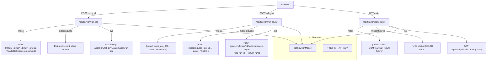

# Design Document: tinyfish-sse-async-harness

## Overview

This feature adds three new TinyFish API route handlers and one targeted edit to `client.ts`, all strictly additive. The goal is to close the gap between the existing synchronous spinner-based agent calls and a judge-visible, live-progress experience.

**What is being built:**

1. **SSE Streaming Proxy** (`/api/tinyfish/run-sse`) — proxies TinyFish's `/v1/automation/run-sse` endpoint, streaming server-sent events to the browser so judges see live agent steps.
2. **Async Run Route** (`/api/tinyfish/run-async`) — starts a long-running agent task without blocking the HTTP connection, returning a `runId` immediately.
3. **Poll Handler** (`/api/tinyfish/poll/[runId]`) — returns the current status and result of an async run by delegating directly to TinyFish's run status API.
4. **Structured Goal Prompt** — improves `runFinancingAgentAssist` in `client.ts` to follow the TinyFish cookbook pattern (4-step goal + strict JSON schema + JSON pre-parse).

All three routes follow the existing three-mode pattern (`mock` / `misconfigured` / `live`) using `getTinyFishMode()` from `src/lib/env.ts`. No existing routes, schemas, or services are modified.

---

## Architecture

The new routes sit alongside the existing `/api/tinyfish/health` and `/api/tinyfish/demo-run` routes. They are thin handlers that delegate to either fixture logic (mock/misconfigured) or direct upstream TinyFish API calls (live). No new service layer is introduced — the routes are intentionally thin per the validate-and-delegate pattern.



**Key architectural decisions:**

- **No in-process run store.** TinyFish's own `run_id` is used directly as the `runId` in poll responses. This avoids any server-side state and makes the poll handler stateless.
- **SSE passthrough is raw.** In live mode, the SSE proxy does not parse or re-validate individual events — it pipes `upstream.body` directly into the response. This keeps the proxy simple and avoids breaking TinyFish's event format.
- **Goal prompt edit is confined to `runFinancingAgentAssist`.** No schema changes, no new exports, no route contract changes.

---

## Components and Interfaces

### 1. SSE Proxy — `src/app/api/tinyfish/run-sse/route.ts`

```typescript
import { getTinyFishMode, isTinyFishLiveReady, TINYFISH_API_KEY } from "@/lib/env"
import { healthCheck } from "@/lib/tinyfish/client"

export const runtime = "nodejs"
export const dynamic = "force-dynamic"

// Shared SSE response headers
function sseHeaders(): HeadersInit {
  return {
    "Content-Type": "text/event-stream",
    "Cache-Control": "no-cache",
    "Connection": "keep-alive",
  }
}

// Encode a payload as an SSE data line
function encodeEvent(payload: Record<string, unknown>): string {
  return `data: ${JSON.stringify(payload)}\n\n`
}

// Shared helper: returns a ReadableStream that emits a MODE event followed by an ERROR event, then closes.
// Used for all error paths so the caller always receives a well-formed SSE stream.
function errorStream(mode: string, error: string): ReadableStream {
  return new ReadableStream({
    start(controller) {
      const enc = new TextEncoder()
      controller.enqueue(enc.encode(encodeEvent({ type: "MODE", mode })))
      controller.enqueue(enc.encode(encodeEvent({ type: "ERROR", error })))
      controller.close()
    },
  })
}

export async function POST(request: Request): Promise<Response>
```

**Body parsing (happens first, before mode check):** The route reads `url` and `goal` from the JSON body inside a `try/catch`. Both are required strings.
- JSON parse failure → `errorStream(mode, "Invalid JSON body")` immediately
- Missing `url` or `goal` → `errorStream(mode, "url and goal are required")` immediately
- Then mode check proceeds

**Mode behavior:**

| Mode | Behavior |
|------|----------|
| `mock` | `ReadableStream` emitting `{ type: "MODE", mode: "mock" }` → 220 ms delay → `{ type: "STEP", index: 1, label: "mock_start" }` → 240 ms delay → `{ type: "STEP", index: 2, label: "mock_extract" }` → 240 ms delay → `{ type: "DONE" }` |
| `misconfigured` | `errorStream("misconfigured", health.details)` where `health = await healthCheck()` and `msg = health.details \|\| "TinyFish live mode misconfigured."` |
| `live` | `fetch` upstream with `X-API-Key`, raw passthrough: `new Response(upstream.body, { headers: sseHeaders() })` |

**Upstream error handling (live):** The upstream fetch is wrapped in a `try/catch`:
- `upstream.ok === false` → `errorStream("live", \`upstream HTTP ${upstream.status}: ${text}\`)`
- `fetch` throws (network error, timeout) → `errorStream("live", err.message)`

---

### 2. Async Run — `src/app/api/tinyfish/run-async/route.ts`

```typescript
import { getTinyFishMode, isTinyFishLiveReady, TINYFISH_API_KEY } from "@/lib/env"
import { healthCheck } from "@/lib/tinyfish/client"

export const runtime = "nodejs"
export const dynamic = "force-dynamic"

export async function POST(request: Request): Promise<Response>
```

**Mode behavior:**

| Mode | runId | status | HTTP |
|------|-------|--------|------|
| `mock` | `"mock_run_001"` | `"PENDING"` | 202 |
| `misconfigured` | `"misconfigured_run_001"` | `"FAILED"` | 202 |
| `live` | TinyFish `run_id` from upstream | `"PENDING"` | 202 |

**Live upstream:** `POST https://agent.tinyfish.ai/v1/automation/run-async` with `X-API-Key` header and `{ url, goal }` body. The upstream fetch is wrapped in a `try/catch`:
- Success: reads `run_id` from response JSON, returns `{ runId: run_id, status: "PENDING", mode: "live" }` with HTTP 202
- `fetch` throws → HTTP 502 `{ runId: "error", status: "FAILED", error: err.message, mode: "live" }`
- Upstream non-2xx → HTTP 502 `{ runId: "error", status: "FAILED", error: "upstream HTTP {status}", mode: "live" }`

**Misconfigured mode:** `health = await healthCheck()`, error message = `health.details || "TinyFish live mode misconfigured."` (error sourced from `healthCheck().details`).

**No in-process store.** The `runId` returned is the TinyFish `run_id` directly. No `Map`, no database write.

---

### 3. Poll Handler — `src/app/api/tinyfish/poll/[runId]/route.ts`

```typescript
import { getTinyFishMode, isTinyFishLiveReady, TINYFISH_API_KEY } from "@/lib/env"
import { healthCheck } from "@/lib/tinyfish/client"

export const runtime = "nodejs"
export const dynamic = "force-dynamic"

export async function GET(
  _: Request,
  ctx: { params: Promise<{ runId: string }> }
): Promise<Response>
```

**Mode behavior:**

| Mode | status | HTTP |
|------|--------|------|
| `mock` | `"COMPLETED"` with `result: { ok: true, fixture: true }`, `startedAt`, `completedAt` | 200 |
| `misconfigured` | `"FAILED"` with error sourced from `healthCheck().details` | 200 |
| `live` | Upstream status/result/error forwarded | 200 or 502 |

**Live upstream:** `GET https://agent.tinyfish.ai/v1/runs/${encodeURIComponent(runId)}` with `X-API-Key`. The upstream fetch is wrapped in a `try/catch`:
- Success (2xx): returns `{ runId, status, result, error, mode, raw }` with HTTP 200
- Upstream non-2xx → HTTP 502 `{ runId, status: "FAILED", error: "upstream HTTP {status}", mode: "live" }`
- `fetch` throws → HTTP 502 `{ runId, status: "FAILED", error: err.message, mode: "live" }`

**Misconfigured mode:** `health = await healthCheck()`, error message = `health.details || "TinyFish live mode misconfigured."` (error sourced from `healthCheck().details`).

---

### 4. Goal Prompt Edit — `src/lib/tinyfish/client.ts` (`runFinancingAgentAssist` only)

The `runFinancingAgentAssist` function receives two targeted changes:

**Change 1 — Goal string (4-step cookbook pattern):**

```typescript
const goal = [
  `STEP 1: Handle any cookie consent banners, popup overlays, or modal dialogs before interacting with page content.`,
  `STEP 2: Navigate to the primary financing or loan product section of ${url}.`,
  `STEP 3: Extract all available financing offers from the page.`,
  `STEP 4: Return strict JSON only — no surrounding prose, no markdown, no explanation.`,
  ``,
  `Required output schema:`,
  `{ "offers": [ { "lender": string, "product": string, "aprPercent": number|null, "termMonths": number|null, "maxAmountUsd": number|null, "decisionSpeed": string|null, "notes": string|null } ] }`,
  ``,
  `Use null for any field you cannot find. Do not invent values.`,
].join("\n")
```

**Change 2 — JSON pre-parse before `normalizeAgentFinancingOffers`:**

```typescript
// Before passing to normalizeAgentFinancingOffers:
let resultValue = payload.result
if (typeof resultValue === "string") {
  try {
    resultValue = JSON.parse(resultValue)
  } catch {
    // pass raw string through — normalizeAgentFinancingOffers handles strings
  }
}
return normalizeAgentFinancingOffers(resultValue, url)
```

All other logic in `runFinancingAgentAssist` and `runAutomationLive` is unchanged.

---

## Data Models

No new persistent data models. The feature is stateless at the application layer — TinyFish owns run state.

**SSE event envelope (in-flight only):**

```typescript
type SseEvent =
  | { type: "MODE"; mode: TinyFishMode }
  | { type: "STEP"; index: number; label: string; observation?: string }
  | { type: "DONE" }
  | { type: "ERROR"; error: string }
```

**Async run response:**

```typescript
interface AsyncRunResponse {
  runId: string
  status: "PENDING" | "FAILED"
  mode: TinyFishMode
  error?: string
}
```

**Poll response:**

```typescript
interface PollResponse {
  runId: string
  status: string          // mirrors TinyFish run status
  mode: TinyFishMode
  startedAt?: string
  completedAt?: string
  result?: unknown
  error?: string
  raw?: unknown
}
```

These are inline types within the route handlers — no new schema files, no modifications to `schemas.ts`.

---

## Correctness Properties

*A property is a characteristic or behavior that should hold true across all valid executions of a system — essentially, a formal statement about what the system should do. Properties serve as the bridge between human-readable specifications and machine-verifiable correctness guarantees.*

### Property 1: SSE response headers are always correct

*For any* TinyFish mode (`mock`, `misconfigured`, or `live`), the SSE proxy response MUST include `Content-Type: text/event-stream` and `Cache-Control: no-cache` headers.

**Validates: Requirements 1.5**

---

### Property 2: SSE passthrough preserves event bytes

*For any* sequence of SSE event bytes received from the upstream TinyFish endpoint in live mode, the proxy response body MUST contain those bytes unchanged — no re-encoding, no re-validation, no transformation.

**Validates: Requirements 1.7**

---

### Property 3: Poll response always echoes runId

*For any* `runId` string and any TinyFish mode, the poll handler response body MUST contain a `runId` field equal to the input `runId`.

**Validates: Requirements 3.2, 3.3, 3.5**

---

### Property 4: All handlers always include a mode field

*For any* TinyFish mode, all three handlers (SSE proxy, async run, poll) MUST include a `mode` field in their response (JSON body or SSE event) that matches the active `TinyFishMode`.

**Validates: Requirements 3.6, 5.4**

---

### Property 5: Mock mode never makes outbound network calls

*For any* of the three new handlers when `getTinyFishMode()` returns `"mock"`, no outbound `fetch` call MUST be made — all responses are fixture-backed.

**Validates: Requirements 5.2**

---

### Property 6: Misconfigured mode always returns a non-empty human-readable error

*For any* of the three new handlers when `getTinyFishMode()` returns `"misconfigured"`, the response MUST contain a non-empty error string (in the JSON body or SSE error event).

**Validates: Requirements 5.3**

---

### Property 7: Goal string always contains all four steps and required field names

*For any* URL passed to `runFinancingAgentAssist`, the constructed goal string MUST contain `STEP 1`, `STEP 2`, `STEP 3`, and `STEP 4`, and MUST contain all required field names: `lender`, `product`, `aprPercent`, `termMonths`, `maxAmountUsd`, `decisionSpeed`, `notes`.

**Validates: Requirements 4.1, 4.2**

---

### Property 8: JSON pre-parse never throws

*For any* value of `payload.result` (string, object, null, array, or any other type), the JSON pre-parse step in `runFinancingAgentAssist` MUST NOT throw — it either returns the parsed object (if the string is valid JSON) or passes the raw value through.

**Validates: Requirements 4.5**

---

## Error Handling

### SSE Proxy

| Failure | Behavior |
|---------|----------|
| JSON parse failure on body | `errorStream(mode, "Invalid JSON body")` — returned before mode check |
| Missing `url` or `goal` | `errorStream(mode, "url and goal are required")` — returned before mode check |
| Upstream fetch throws (network error, timeout) | `errorStream("live", err.message)` |
| Upstream returns non-2xx | `errorStream("live", \`upstream HTTP ${upstream.status}: ${text}\`)` |
| Misconfigured mode | `errorStream("misconfigured", health.details \|\| "TinyFish live mode misconfigured.")` — error sourced from `healthCheck().details` |

The handler never returns a JSON error response — it always returns an SSE stream so the client can use a single `EventSource` / `ReadableStream` consumer.

### Async Run

| Failure | Behavior |
|---------|----------|
| Invalid/missing JSON body | HTTP 400 `{ error: "url and goal are required" }` |
| Upstream fetch throws | HTTP 502 `{ runId: "error", status: "FAILED", error: err.message, mode: "live" }` |
| Upstream returns non-2xx | HTTP 502 `{ runId: "error", status: "FAILED", error: "upstream HTTP {status}", mode: "live" }` |
| Misconfigured mode | HTTP 202 `{ runId: "misconfigured_run_001", status: "FAILED", error: health.details \|\| "TinyFish live mode misconfigured.", mode: "misconfigured" }` — error sourced from `healthCheck().details` |

### Poll Handler

| Failure | Behavior |
|---------|----------|
| Missing runId param | HTTP 400 `{ error: "runId is required" }` |
| Upstream fetch throws | HTTP 502 `{ runId, status: "FAILED", error: err.message, mode: "live" }` |
| Upstream returns non-2xx | HTTP 502 `{ runId, status: "FAILED", error: "upstream HTTP {status}", mode: "live" }` |
| Misconfigured mode | HTTP 200 `{ runId, status: "FAILED", error: health.details \|\| "TinyFish live mode misconfigured.", mode: "misconfigured" }` — error sourced from `healthCheck().details` |

### Goal Prompt / JSON Pre-parse

The `JSON.parse` attempt on `payload.result` is wrapped in a `try/catch`. On failure, the raw value is passed to `normalizeAgentFinancingOffers` unchanged. `normalizeAgentFinancingOffers` already handles strings via `asOfferArray` (which itself tries `JSON.parse`), so the fallback is safe.

---

## Verification

Sanity-check curl commands for manual testing against a local dev server (`localhost:3000`):

```bash
# SSE route — streams events to the terminal
curl -N -X POST http://localhost:3000/api/tinyfish/run-sse \
  -H "Content-Type: application/json" \
  -d '{"url":"https://example.com","goal":"Return JSON {\"ok\":true}"}'

# Async run — returns runId immediately
curl -s -X POST http://localhost:3000/api/tinyfish/run-async \
  -H "Content-Type: application/json" \
  -d '{"url":"https://example.com","goal":"Return JSON {\"ok\":true}"}'

# Poll — replace <runId> with the value returned above
curl -s http://localhost:3000/api/tinyfish/poll/<runId>
```

---

## Testing Strategy

### Approach

This feature is well-suited for property-based testing on the pure logic layer (header invariants, runId echo, mode field presence, goal string structure, JSON pre-parse safety) combined with example-based tests for the specific mock/misconfigured fixture shapes and integration tests for the live upstream paths.

**Property-based testing library:** [fast-check](https://github.com/dubzzz/fast-check) (already compatible with Vitest, which is the project's test runner per `vitest.config.ts`).

**Minimum iterations per property test:** 100.

**Tag format:** `// Feature: tinyfish-sse-async-harness, Property {N}: {property_text}`

### Unit / Example Tests

- SSE mock mode emits exactly: `MODE` → `STEP` → `STEP` → `DONE` events in order
- SSE misconfigured mode emits exactly one `ERROR` event
- Async run mock returns `{ runId: "mock_run_001", status: "PENDING", mode: "mock" }` with HTTP 202
- Async run misconfigured returns `{ runId: "misconfigured_run_001", status: "FAILED", mode: "misconfigured" }` with HTTP 202
- Poll mock returns `{ status: "COMPLETED", result: { ok: true, fixture: true } }` with HTTP 200
- Poll misconfigured returns `{ status: "FAILED" }` with HTTP 200
- Goal string contains "null" instruction and "no surrounding prose" instruction
- Existing `/api/tinyfish/health` and `/api/tinyfish/demo-run` routes return unchanged shapes (smoke)

### Property Tests

**Property 1 — SSE headers always correct:**
```
// Feature: tinyfish-sse-async-harness, Property 1: SSE response headers are always correct
fc.property(fc.constantFrom("mock", "misconfigured"), async (mode) => {
  // set mode, call handler, assert Content-Type and Cache-Control headers
})
```

**Property 3 — Poll always echoes runId:**
```
// Feature: tinyfish-sse-async-harness, Property 3: Poll response always echoes runId
fc.property(fc.string({ minLength: 1 }), fc.constantFrom("mock", "misconfigured"), async (runId, mode) => {
  // call poll handler with runId, assert response.runId === runId
})
```

**Property 4 — All handlers include mode field:**
```
// Feature: tinyfish-sse-async-harness, Property 4: All handlers always include a mode field
fc.property(fc.constantFrom("mock", "misconfigured"), async (mode) => {
  // call each handler, assert mode field present and matches
})
```

**Property 5 — Mock mode never makes outbound fetch:**
```
// Feature: tinyfish-sse-async-harness, Property 5: Mock mode never makes outbound network calls
fc.property(fc.record({ url: fc.webUrl(), goal: fc.string({ minLength: 1 }) }), async (body) => {
  // mock fetch, call each handler in mock mode, assert fetch was never called
})
```

**Property 6 — Misconfigured always returns non-empty error:**
```
// Feature: tinyfish-sse-async-harness, Property 6: Misconfigured mode always returns non-empty error
fc.property(fc.string({ minLength: 1 }), async (runId) => {
  // call each handler in misconfigured mode, assert error field is non-empty string
})
```

**Property 7 — Goal string structure:**
```
// Feature: tinyfish-sse-async-harness, Property 7: Goal string always contains all four steps and required field names
fc.property(fc.webUrl(), (url) => {
  const goal = buildGoalString(url) // extract goal builder to a pure function for testability
  assert(goal.includes("STEP 1") && goal.includes("STEP 2") && goal.includes("STEP 3") && goal.includes("STEP 4"))
  for (const field of ["lender", "product", "aprPercent", "termMonths", "maxAmountUsd", "decisionSpeed", "notes"]) {
    assert(goal.includes(field))
  }
})
```

**Property 8 — JSON pre-parse never throws:**
```
// Feature: tinyfish-sse-async-harness, Property 8: JSON pre-parse never throws
fc.property(fc.oneof(fc.string(), fc.jsonValue(), fc.constant(null)), (result) => {
  // call the pre-parse logic, assert it never throws
})
```

### Integration Tests

- Live SSE proxy: mock upstream returning SSE bytes, verify passthrough (1 test)
- Live async run: mock upstream returning `{ run_id: "abc" }`, verify `runId: "abc"` in response (1 test)
- Live poll: mock upstream returning `{ status: "COMPLETED", result: {...} }`, verify shape (1 test)
- Live poll upstream non-2xx: mock upstream returning 500, verify HTTP 502 response (1 test)
